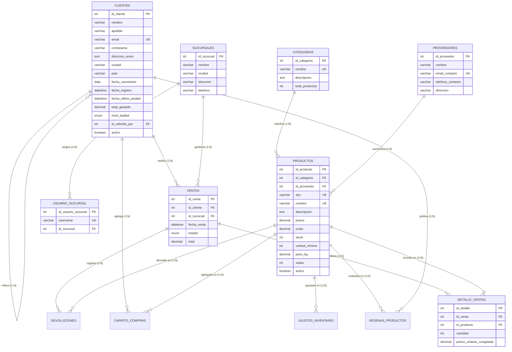

# Proyecto de Base de Datos para un E-commerce

## 📋 Descripción Breve
Este proyecto implementa el núcleo integral de una base de datos relacional para una plataforma de comercio electrónico, sobre el motor **MySQL 8.0+**. El sistema administra de forma segura y transaccional el catálogo de productos, inventario, categorización, proveedores, clientes y el ciclo de vida completo de las órdenes de venta. Incorpora lógica de negocio avanzada mediante 20 consultas analíticas (CTEs, Window Functions), 20 funciones definidas por el usuario (UDFs), 20 triggers de integridad y auditoría, 20 eventos programados de mantenimiento y agregación, 20 procedimientos almacenados transaccionales, y un modelo de seguridad basado en roles (RBAC) con control de acceso por sucursal a nivel de fila (RLS).

---

## Integrantes del Equipo
- **Nombre Completo:** Juan Sebastián Dominguez
- **Correo Electrónico:** [Jsebased@gmail.com]

---

## 🗺️ Diagrama Entidad-Relación (Modelo Relacional Núcleo)



> Nota: este diagrama muestra el modelo núcleo de negocio. Las tablas de auditoría, reportería y monitoreo creadas en `04_Seguridad.sql`, `05_Triggers.sql` y `06_Eventos.sql` se documentan aparte en la sección de **Notas Técnicas**, ya que por diseño no todas mantienen una relación formal (`FOREIGN KEY`) con el modelo núcleo.

---

## 📂 Estructura de Archivos del Proyecto

Todos los scripts se ubican en la raíz del repositorio, segmentados por responsabilidad:

| Archivo | Descripción del Contenido |
| :--- | :--- |
| `01_Esquema_y_Datos.sql` | `CREATE DATABASE`, `CREATE TABLE` (claves primarias, foráneas, restricciones `CHECK`) para las 14 tablas del modelo de negocio, e `INSERT INTO` con datos de ejemplo estandarizados. |
| `02_Consultas_Avanzadas.sql` | Las **20 consultas SQL** de análisis y reporteo de negocio (CTEs, Window Functions, cohortes, RFM, márgenes, carritos abandonados), cada una precedida por un comentario con la pregunta de negocio que responde. |
| `03_Funciones.sql` | Las **20 funciones definidas por el usuario (UDFs)** para cálculos de impuestos, lealtad, envío, validaciones de email/contraseña y reglas de negocio reutilizables. |
| `04_Seguridad.sql` | Esquema de seguridad granular: **7 roles**, **5 usuarios** con rol por defecto, vistas de seguridad (anonimización de clientes y RLS por sucursal), cuotas de recursos y política de contraseñas. |
| `05_Triggers.sql` | Tablas de auditoría de soporte y los **20 triggers** que automatizan validaciones de inventario, auditoría de cambios y restricciones de integridad. |
| `06_Eventos.sql` | Activación del `event_scheduler`, tablas de reportería de soporte y los **20 eventos programados** para mantenimiento, agregaciones y cálculo de KPIs. |
| `07_Procedimientos_Almacenados.sql` | Los **20 procedimientos almacenados** transaccionales (`START TRANSACTION` / `COMMIT` / `ROLLBACK`) para operaciones complejas de venta, devolución y administración. |
| `README.md` | Este documento. |

---

## ▶️ Instrucciones de Ejecución

Los scripts **deben ejecutarse en orden numérico estricto**, ya que cada archivo depende de objetos creados en los anteriores.

### 1. Requisitos Previos
- Servidor **MySQL 8.0 o superior** en ejecución.
- Cliente de línea de comandos de MySQL, o herramienta gráfica (**DBeaver**, **MySQL Workbench**, **phpMyAdmin**).
- Verificar/activar el planificador de eventos (usado por `06_Eventos.sql`):
  ```sql
  SET GLOBAL event_scheduler = ON;
  ```

### 2. Ejecución desde MySQL CLI
```bash
mysql -u root -p < 01_Esquema_y_Datos.sql
mysql -u root -p ecommerce_db < 02_Consultas_Avanzadas.sql
mysql -u root -p ecommerce_db < 03_Funciones.sql
mysql -u root -p ecommerce_db < 04_Seguridad.sql
mysql -u root -p ecommerce_db < 05_Triggers.sql
mysql -u root -p ecommerce_db < 06_Eventos.sql
mysql -u root -p ecommerce_db < 07_Procedimientos_Almacenados.sql
```

### 3. Ejecución desde DBeaver / MySQL Workbench
1. Abrir cada archivo con el editor SQL, conectado a la instancia local.
2. Ejecutar como **script completo** (no sentencia por sentencia) para respetar los bloques `DELIMITER`.
3. Repetir en orden estricto del `01` al `07`.

---

## 🔐 Roles y Usuarios Creados (`04_Seguridad.sql`)

Se crean **7 roles**, de los cuales **5 tienen un usuario asignado** para pruebas (`Auditor_Financiero` y `Visitante` quedan como roles disponibles para asignar a futuro, sin usuario de prueba dedicado):

| Usuario | Rol asignado | Alcance |
|---|---|---|
| `admin_user` | `Administrador_Sistema` | Control total sobre `ecommerce_db` |
| `marketing_user` | `Gerente_Marketing` | Lectura de ventas, clientes, promociones y ejecución de reportes de marketing |
| `inventory_user` | `Empleado_Inventario` | Lectura de catálogo/categorías y `UPDATE` exclusivo sobre `productos.stock` |
| `support_user` | `Atencion_Cliente` | Lectura de ventas y clientes, `UPDATE` limitado a dirección/ciudad, sin acceso a precios |
| `analista_user` | `Analista_Datos` | Lectura de todas las tablas de negocio excepto auditoría; `DELETE`/`DROP` revocados; límite de 100 consultas/hora |

> ⚠️ Las contraseñas del script son de **prueba/entorno académico**. En producción deben rotarse y nunca versionarse en texto plano.

---

## 🧩 Notas Técnicas y Decisiones de Diseño

- **Compatibilidad con `ONLY_FULL_GROUP_BY`:** las consultas de crecimiento de clientes y ventas por hora agrupan primero en una subconsulta y construyen el `CONCAT`/`CASE` sobre los alias ya calculados, evitando el error 1055 de MySQL 8.
- **Revocaciones idempotentes:** `04_Seguridad.sql` usa `REVOKE IF EXISTS` para `DELETE`/`DROP` (rol `Analista_Datos`) y `UPDATE (precio)` (rol `Empleado_Inventario`), ya que esos privilegios nunca fueron otorgados explícitamente.
- **Procedimiento previo al `GRANT`:** `sp_GenerarReporteMensualVentas` se crea dentro de `04_Seguridad.sql` inmediatamente antes de otorgarle `EXECUTE` al rol `Gerente_Marketing`, para que el `GRANT` no falle por objeto inexistente.
- **Integridad referencial en tablas de soporte:** `log_cambios_precio`, `alertas_stock`, `reorden_inventario`, `ranking_productos` y `reporte_rendimiento_proveedores` referencian `productos`/`proveedores`; `alertas_fraude` y `cupones_cumpleanos` referencian `clientes`. Usan `ON DELETE CASCADE` porque las entidades padre usan baja lógica (`activo`) y no se eliminan físicamente.
- **Tablas de auditoría/histórico sin `FOREIGN KEY` (por diseño):** `auditoria_clientes`, `auditoria_pedidos`, `auditoria_permisos`, `ventas_archivadas`, `backup_logico_ventas`, `historial_logs_archivo`, `log_intentos_login_fallidos` y `asignaciones_roles` quedan desacopladas a propósito, para que el registro de auditoría sobreviva aunque el dato original se elimine o archive (por ejemplo, `ventas_archivadas` se llena en un trigger `BEFORE DELETE` sobre `ventas`; una FK ahí bloquearía el propio `DELETE`).
- **Tablas de reportería/agregación sin `FOREIGN KEY` (por diseño):** `resumen_ventas_diarias`, `reporte_ventas_semanales`, `kpis_mensuales` y `vm_resumen_categoria` almacenan datos agregados de múltiples filas, sin relación 1 a 1 con una entidad puntual.
- **Tablas de monitoreo interno:** `log_tamano_bd`, `log_inconsistencias_datos` y `staging_limpieza_temp` son utilitarias del propio motor, sin entidad de negocio asociada.

---

## 📊 Cobertura del Proyecto
- ✅ 6 entidades núcleo + 8 tablas de apoyo al negocio + 21 tablas de soporte a triggers/eventos/seguridad.
- ✅ 20 consultas avanzadas · 20 funciones · 20 triggers · 20 eventos · 20 procedimientos almacenados.
- ✅ 7 roles y 5 usuarios de prueba con permisos granulares y auditoría de accesos fallidos.

---

## 🚀 Guía de Entrega en GitHub

### 1. Crear el repositorio
1. Inicie sesión en [GitHub](https://github.com).
2. Cree un **repositorio privado** con el formato exacto: `Proyecto_BD_Avanzada_[NombreEquipo]`.
3. No lo inicialice con README ni `.gitignore` (ya están creados localmente).

### 2. Commits locales, archivo por archivo (Conventional Commits)
```bash
git init
git add README.md
git commit -m "docs(readme): add project overview, setup and execution guide"

git add 01_Esquema_y_Datos.sql
git commit -m "feat(schema): create database schema and seed initial e-commerce data"

git add 02_Consultas_Avanzadas.sql
git commit -m "feat(queries): add 20 advanced business analytics queries"

git add 03_Funciones.sql
git commit -m "feat(functions): add 20 reusable user-defined functions"

git add 04_Seguridad.sql
git commit -m "feat(security): add roles, users and granular privilege grants"

git add 05_Triggers.sql
git commit -m "feat(triggers): add audit tables and 20 data-integrity triggers"

git add 06_Eventos.sql
git commit -m "feat(events): add reporting tables, 20 scheduled events and event scheduler"

git add 07_Procedimientos_Almacenados.sql
git commit -m "feat(procedures): add 20 transactional stored procedures"
```

### 3. Vincular y subir
```bash
git branch -M main
git remote add origin https://github.com/<tu-usuario>/Proyecto_BD_Avanzada_<NombreEquipo>.git
git push -u origin main
```

### 4. Invitar al Trainer
1. En el repositorio, ir a **Settings → Collaborators → Add people**.
2. Ingresar el usuario de GitHub del Trainer y enviar la invitación con acceso de lectura.